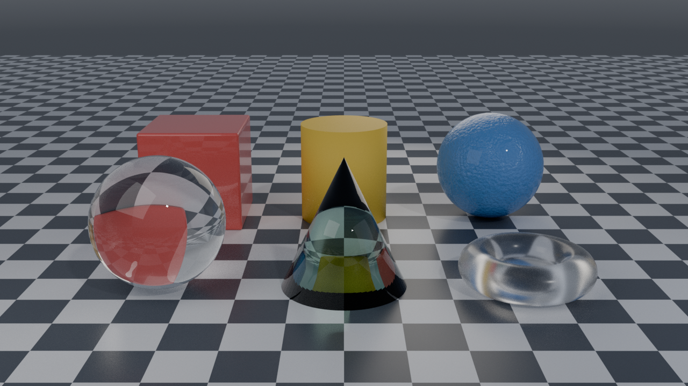
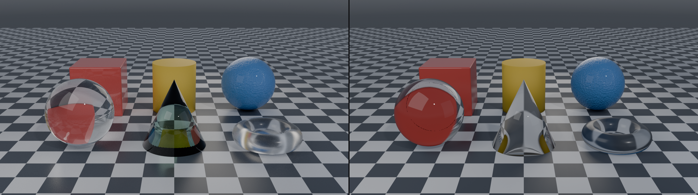

# blender-codeshade-demo

Plastic and glass materials applied to primitives, with the whole scene —
geometry, node graphs, lighting, camera, render settings — built in Python and
rendered with no GUI ever opening.



*Cycles, 1280×720, 384 samples. Back row: glossy, matte and procedurally
textured plastic. Front row: clear, tinted and frosted glass.*

## Quick start

```bash
# both engines, 1280x720; also saves a .blend project
./run.sh

# or drive it directly
blender --background --factory-startup --python render_demo.py -- \
        --engine cycles --samples 256 --width 1920 --height 1080

# see every material's node graph as text, without rendering
blender --background --factory-startup --python dump_graphs.py
```

Rendered PNGs land in `renders/`. Once rendering finishes, the scene is also
saved as a Blender project in `example/`, with the finished renders **packed
inside it** — so the project opens anywhere with the pictures already in the
Image editor next to the node graphs that produced them. `example/` is
generated output and is gitignored; `--no-project` skips it and
`--project-dir` moves it. Set `BLENDER=/path/to/blender` if it isn't on
`PATH`. Nothing is downloaded at runtime — the environment is a procedural
gradient, not an HDRI file, so the demo is self-contained.

## The questions this demo answers

### Can you build a render pipeline with no GUI?

Yes, completely. `blender --background --python script.py` starts Blender with
no window and hands your script the full `bpy` API. There is no reduced
"headless mode" — the same API that backs every button in the UI is what you
are calling. This is how render farms have always worked.

Two ways to get there:

| Approach | Use when |
| --- | --- |
| `blender --background --python script.py` | Normal case. Blender drives, your script is a plugin. |
| `pip install bpy` | You want Blender as a library inside an existing Python app. Same API, version-locked to one Python. |

This demo uses the first. Arguments after a bare `--` are handed to your
script instead of being eaten by Blender:

```bash
blender --background --python render_demo.py -- --engine cycles --samples 256
```

Two things bite immediately in a headless container, and both are handled in
`render_demo.py`:

- **Blender does not put your script's directory on `sys.path`** — it puts the
  *current working directory* there. Importing sibling modules needs an
  explicit `sys.path.insert` (top of `render_demo.py`), or the script only works
  when run from its own folder.
- **Cycles is an add-on and may not be registered.** With `--factory-startup`
  it is never enabled, and distro packages often don't enable it by default.
  Setting `render.engine = 'CYCLES'` then raises. `enable_cycles()`
  in `render_demo.py` turns it on via `addon_utils`.

### What does it look like if you program it instead of wiring it in the shader editor?

The shader editor is a *view* onto `material.node_tree`. Dragging a node
creates an entry in `node_tree.nodes`; dropping a noodle appends to
`node_tree.links`. Scripting mutates the same two collections, so the render is
byte-identical either way. Concretely, this:

```python
graph = ShaderGraph.for_material("M_Ico")
coords = graph.add("ShaderNodeTexCoord")
noise  = graph.add("ShaderNodeTexNoise", inputs={"scale": 18.0, "detail": 6.0})
bump   = graph.add("ShaderNodeBump", inputs={"strength": 0.25})
bsdf   = graph.add("ShaderNodeBsdfPrincipled")

graph.link(coords, "Object", noise, "Vector")
graph.link(noise, "Fac", bump, "Height")
graph.link(bump, "Normal", bsdf, "Normal")
```

produces exactly what you'd get by hand. `dump_graphs.py` prints the result,
which is the shader editor's content minus the boxes:

```
=== M_Ico ===============================================================
Bump  [ShaderNodeBump]  at (-560, 150)
  Strength = 0.25
Noise  [ShaderNodeTexNoise]  at (-840, 0)
  Scale = 18.0
  Detail = 6.0
  Distortion = 0.2
Plastic  [ShaderNodeBsdfPrincipled]  at (-280, 0)
  Base Color = (0.09, 0.29, 0.68, 1.0)
  IOR = 1.46
  Coat Weight = 0.35
RoughnessRamp  [ShaderNodeValToRGB]  at (-560, -150)
TexCoord  [ShaderNodeTexCoord]  at (-1120, 0)
links:
  TexCoord.Object -> Noise.Vector
  Noise.Fac -> Bump.Height
  Noise.Fac -> RoughnessRamp.Fac
  Bump.Normal -> Plastic.Normal
  RoughnessRamp.Color -> Plastic.Roughness
  Plastic.BSDF -> Output.Surface
```

Three differences are real, and none of them changes a pixel:

1. **Nodes have no layout.** `nodes.new()` places everything at `(0, 0)`, so a
   scripted graph opens in the GUI as one stack of overlapping boxes.
   `auto_layout()` in `shadergraph.py` assigns positions by distance from the
   output node — that's the only reason the coordinates above are non-zero.
2. **Sockets are addressed by name, and names change between versions.**
   Blender 4.0 renamed `Transmission` → `Transmission Weight`, `Clearcoat` →
   `Coat Weight`, `Specular` → `Specular IOR Level`. A script written against
   3.x throws `KeyError` on 4.x. `SOCKET_ALIASES` in `shadergraph.py` resolves
   both spellings so one script covers both.
3. **You get diffs, loops and parameters.** Six materials here come from four
   functions; the node graph is reviewable in a pull request. That's the actual
   reason to do it in code.

### Does it require ray tracing, or is that optional?

**Optional for plastic, effectively required for glass.** The demo renders the
identical scene with both engines so you can see where the line falls:

| | Cycles (path traced) | EEVEE (rasterised) |
| --- | --- | --- |
| Glossy / matte / textured plastic | correct | visually equivalent |
| Clear glass | refracts the scene, checker inverts | no true refraction |
| Tinted glass (volume absorption) | green, deeper where thicker | tint ignored — reads as chrome |
| Frosted glass | correct rough transmission | approximated |
| Caustics on the floor | yes | none |
| Time (1280×720, 4-core CPU, software GL) | 318 s @ 384 spp | 111 s @ 128 spp |



*Same scene, same materials, same lights. Left: Cycles. Right: EEVEE.*

The three plastics are indistinguishable between the two. The glass is not:

- **Sphere** — Cycles inverts the checker through it and bends the red cube
  behind it. EEVEE shows the cube nearly straight through, as if the sphere
  were a flat window.
- **Cone** — Cycles absorbs along the path, so it is pale at the tip and
  saturated through the thick base. EEVEE drops the volume entirely and the
  cone renders as untinted chrome.
- **Torus** — Cycles scatters transmitted light and drops a caustic on the
  floor. EEVEE gives it a metallic sheen and no caustic anywhere.

Why the split: plastic is an opaque surface, so its shading depends only on the
lights and the surface itself — a rasteriser evaluates that exactly. Glass is
defined by *what is behind it*. Getting that right means following the ray as
it bends at the surface, hits the back face, bends again, and lands somewhere in
the scene. A rasteriser has no ray to follow, so EEVEE approximates it with
screen-space refraction: it samples the already-rendered colour buffer, which
only contains what is on screen and in front. Anything off-screen or hidden is
simply not available, and volumes inside a refractive surface are skipped
entirely — which is why the tinted cone loses its colour.

So the practical answer:

- Plastic-only pipeline → EEVEE is fine, and much faster. The 2.9× measured
  above understates it badly: this box has no GPU, so EEVEE was rasterising
  through llvmpipe. On real hardware EEVEE is typically orders of magnitude
  ahead, which is the whole reason to reach for it.
- Anything glass, and especially anything with caustics or coloured/thick
  glass → use Cycles.
- EEVEE Next (Blender 4.2+) narrows the gap with real screen-space ray tracing
  (`scene.eevee.use_raytracing`, set in `configure_eevee()`), but it is still
  screen-space: it cannot refract what was never drawn.

Ray tracing is not a checkbox you turn on inside Cycles, by the way — Cycles
*is* a path tracer. The relevant knobs are how many bounces you allow. For
glass the one that matters is transmission depth:

```python
cycles.transmission_bounces = 16   # too low and glass renders black
cycles.caustics_refractive = True  # light focused through glass onto the floor
```

Each surface a ray passes through spends one transmission bounce, and a solid
glass object needs several just to get out the other side.

## Files

| File | Purpose |
| --- | --- |
| `shadergraph.py` | Node-tree helpers: builder, socket-name aliasing, auto-layout, text dump |
| `materials.py` | The six materials plus checker floor and gradient world |
| `scene.py` | Primitives, floor, camera, three-point light rig |
| `render_demo.py` | CLI entry point: engine setup, colour management, render |
| `dump_graphs.py` | Print node trees as text, no render |
| `make_comparison.py` | Stitch the two engine renders into one side-by-side PNG |
| `run.sh` | Wrapper — both engines, saves a `.blend` project |
| `example/` | Generated `.blend` project with the renders packed in (gitignored) |

## The materials

**Plastic** is a dielectric: `metallic = 0`, `IOR ≈ 1.46`, mid roughness. The
detail that sells it is the **clear coat** — a second, sharper specular lobe
over the diffuse body, which is what separates moulded plastic from matte paint.
The cube is also bevelled (0.045, 3 segments), because a mathematically sharp
edge never catches a highlight and reads as CG immediately.

**Glass** is `transmission = 1.0` with `IOR ≈ 1.45–1.52`. Roughness 0 is optical
glass, 0.22 is frosted. Frosted is the expensive one: every ray leaves in a
slightly different direction, so it drives your sample count.

**Tinted glass** deliberately does *not* tint the base colour. Real glass gets
its colour from absorption along the path through it, so a thick part should be
darker than a thin part. That means a `Volume Absorption` node wired to the
material output's **Volume** socket, not the Surface socket:

```
Glass  -> Output.Surface
Absorb -> Output.Volume
```

Look at the cone in the Cycles render: it's paler near the tip and saturated
through the base. Tinting the base colour instead gives a uniform, flat, plastic-
looking green.

## Notes and gotchas

Verified against **Blender 4.0.2** on a headless Linux container.

- **Denoising is not always compiled in.** Distro builds are often built without
  OpenImageDenoise. Assigning `cycles.denoiser = 'OPENIMAGEDENOISE'` succeeds
  and then *fails at render time*, which reads like a broken render.
  `configure_denoising()` checks whether the `denoiser` enum has any items at
  all and falls back to more samples.
- **Some RNA enums can't be introspected.** `RenderSettings.bl_rna` reports only
  `BLENDER_EEVEE` even when Cycles is loaded and working, and the colour
  management enums come from the OCIO config and report `NONE`. Assign and catch
  `TypeError` instead of trusting `enum_items` for those.
- **EEVEE needs a GPU context even in `--background`.** On a bare container it
  fails with `Couldn't open libEGL.so.1` until you install `libegl1` / `libgl1`
  / `libgl1-mesa-dri`; it then falls back to surfaceless EGL on llvmpipe.
  Cycles needs none of this — it's pure CPU.
- **Smooth shading without version branching.** Blender 4.1 removed
  `mesh.use_auto_smooth` in favour of a modifier. `_shade_smooth()` sets
  `polygon.use_smooth` directly, keeping cylinder and cone caps faceted by
  testing the polygon normal — works on every version.
- **Checker scale is in squares per unit of object space.** The floor plane is
  60 units across, so its object coordinates span ±30 and a scale of 14 gives
  invisibly fine squares. 1.2 gives readable ones.

- **A .blend never contains the render.** Blender's output lives in a special
  `Render Result` image that is a temporary viewer buffer — save a project and
  it comes back 0×0 and empty. Getting the finished frames into the project
  means loading the PNGs back off disk after rendering and calling
  `image.pack()`, and then `use_fake_user = True`, because nothing in the
  scene references those images and Blender drops unreferenced datablocks on
  save.

The EEVEE image here was produced on software OpenGL (llvmpipe), which also
logged a shader link warning (`unresolved reference to 'F0_from_ior'`). The
plastic/glass split it shows matches EEVEE's documented behaviour, but treat the
EEVEE frame as indicative rather than a reference-quality EEVEE render.
