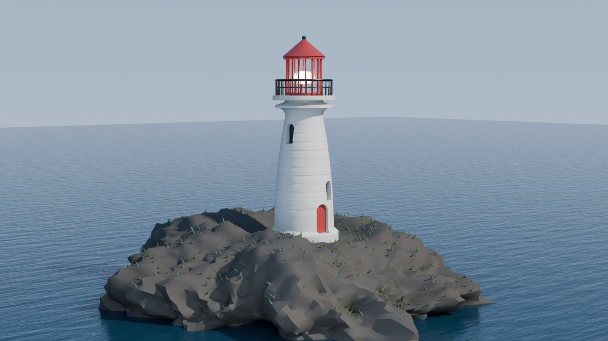
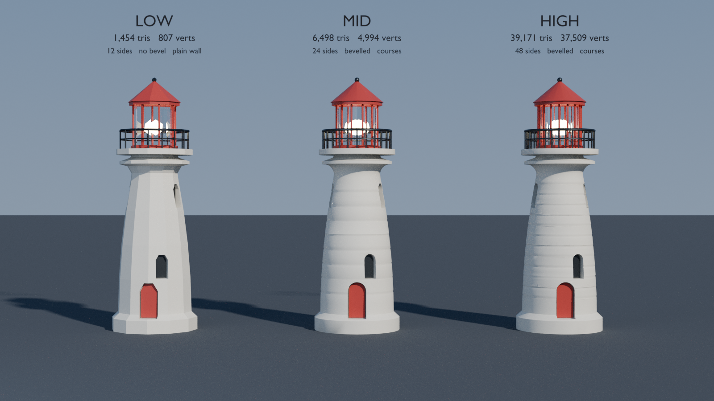
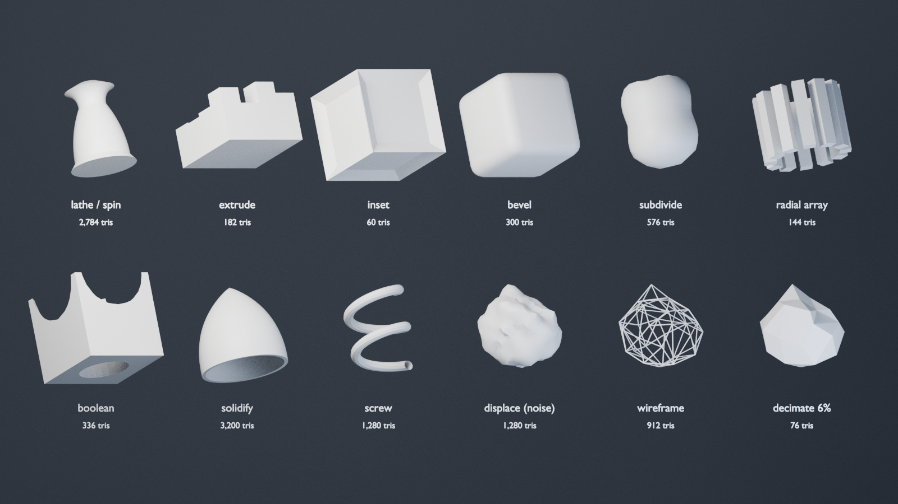

# blender-procmesh-demo

A lighthouse on a rock in the sea. The silhouette, the masonry courses, the
window reveals, the railing, the rock and the grass on it are all defined in
Python. No GUI was opened, nothing was sculpted, nothing was downloaded, and
no mesh file is checked in — only the code that generates one.



*Cycles, 1600×900. About 68,000 triangles, all of them computed.*

## Quick start

```bash
./run.sh                       # all three renders, 1600x900

# or drive it directly
blender --background --factory-startup --python render_demo.py -- \
        --shot hero --detail high --samples 300

blender --background --factory-startup --python render_demo.py -- --stats
blender --background --factory-startup --python render_demo.py -- --dump-scatter
```

Rendered PNGs land in `renders/`. Once a shot finishes rendering, its scene is
also saved as a Blender project in `example/` — one `.blend` per shot, with
that shot's finished render **packed inside it**, so the project opens
anywhere with the picture already in the Image editor next to the scene that
produced it. `example/` is generated output and is gitignored; `--no-project`
skips it and `--project-dir` moves it.

Set `BLENDER=/path/to/blender` if it isn't on `PATH`. `--stats` prints the
topology table without rendering anything.

## The question this demo answers

> What is the best we can do with all the modelling defined in code? Is a 3-D
> modeller required to sit in a GUI and carve the details by hand?

Short answer: **no GUI is required, and for this kind of asset code is the
better tool — but "best effort in code" is limited by art direction and
iteration speed, not by the API.** The rest of this file is the evidence.

### Can you model, not just shade, without a GUI?

Yes, and not through a reduced API. Blender's mesh editing lives in `bmesh`,
which is a pure data library with no dependency on a window, an active object,
a selection or a mode. `bmesh.ops.*` **is** what edit mode calls when you press
a key. Scripting is not an alternative path to the same result; it is the same
path with the buttons removed:

| edit mode | this demo |
| --- | --- |
| Spin / Screw (Alt-R) | `meshlib.lathe` → `bmesh.ops.spin` |
| Extrude (E) | `meshlib.extrude` → `bmesh.ops.extrude_face_region` |
| Inset (I) | `meshlib.inset` → `bmesh.ops.inset_region` |
| Bevel (Ctrl-B) | `meshlib.bevel` → `bmesh.ops.bevel` |
| Subdivide | `meshlib.subdivide` → `bmesh.ops.subdivide_edges` |
| Merge by Distance (M) | `meshlib.weld` → `bmesh.ops.remove_doubles` |
| Select Sharp Edges | `meshlib.sharp_edges` (by dihedral angle) |
| Shade Auto Smooth | `meshlib.shade` → `bmesh.ops.split_edges` |
| the Modifier stack | `meshlib.modifier` / `meshlib.bake` |
| Geometry Nodes editor | `geonodes.scatter_tree` |

The one genuine difference is that `bpy.ops.mesh.*` operators depend on
context — an active object, the right mode — which is what makes people think
headless modelling is awkward. Going through `bmesh` sidesteps that completely.
Nothing in `meshlib.py` needs a context, and nothing in it can fail because
the wrong object was selected.

### What does "the same model, low poly *or* refined" mean in code?

It means one argument. `detail.py` holds three presets; every builder takes one
and asks it how densely to sample, whether to bevel, whether to cut masonry
courses, and how to shade the result. The three towers below are the same
eleven-line profile, three times.



*One definition, three densities, one camera. Left to right: 12, 24 and 48
lathe segments.*

```
$ blender --background --factory-startup --python render_demo.py -- --stats

level     objects    vertices   triangles     x low
low            39         807       1,454      1.0x
mid            51       4,994       6,498      4.5x
high           63      37,405      39,085     26.9x
```

Same builders, same eleven-line profile, one argument. The object count rises
with detail because the railing and the lantern get more balusters and mullions
— a loop bound, not more modelling. The counts are measured off the evaluated
dependency graph rather than estimated, so they include what the modifiers add.
`low` and `mid` reproduce exactly; `high` moves by a few dozen triangles
between runs, for the reason in the last note at the bottom of this file.

This is the part that does not survive translation to a GUI. In a viewport you
author a **mesh**: the moment you draw the tower's outline you have committed
to how many vertices it has, and the low-poly version and the refined version
are two files that will drift apart. In a script you author a **definition** —

```python
ml.Profile(0.0, 0.0)
  .line_to(PLINTH_RADIUS, 0.0)
  .line_to(PLINTH_RADIUS, PLINTH_TOP)
  .line_to(1.60, SHAFT_BOTTOM)
  .curve_to(SHAFT_TOP_RADIUS, SHAFT_TOP, bulge=-0.045, steps=12)   # entasis
  .curve_to(CORNICE_RADIUS, 7.18, bulge=0.42, steps=6)
  ...
```

— and the vertex count is decided later, by `sample(density)`. The outline has
no resolution until something asks for one.

Two details in there are worth pointing at, because they are exactly the sort
of thing people assume needs a human with a mouse:

- **`bulge=-0.045` is entasis.** The shaft bows very slightly inward on its way
  up rather than tapering in a straight line. It is the difference between a
  lighthouse and a length of pipe, it is invisible until you remove it, and it
  costs one number.
- **The masonry courses are geometry, not texture.** `meshlib.insert_grooves`
  walks the sampled outline and splices three extra points into it every
  0.44 m; the lathe turns each one into a ring. They follow the taper for free,
  because the radius is looked up per course on a wall that is narrowing, and
  they cost nothing in the radial direction. Carving them by hand means a loop
  cut and an inset per course, up a cone.

### The operations, one tile each



*Twelve operations, twelve tiles, one per operation, with the resulting
triangle count. Top row builds shape; bottom row thickens, roughens and
reduces it.*

The last three tiles are the low-poly answer specifically. `displace (noise)`
is a sphere pushed around by a fractal noise function — procedural surface
detail that nobody sculpted. `wireframe` is what is left after reducing it, and
`decimate 6%` is that reduction rendered solid. So there are two routes to a
low-poly asset and both are scripted:

1. **Author it sparse.** Pick small segment counts, skip the bevels, shade
   flat. That is what `detail.LOW` does, and the facets are the style rather
   than an artefact — which is why its counts are chosen to read well faceted
   (12 and 8 sided) instead of to approximate a circle badly.
2. **Author it dense and throw geometry away.** A Decimate modifier at 6 %
   takes the 1,280-triangle displaced sphere down to 76 and keeps the
   silhouette. No hand retopology involved.

### So do you need a modeller to carve the detail by hand?

For this asset, no — and the honest general answer splits cleanly:

**Code wins outright when the detail follows a rule.**

| | why |
| --- | --- |
| Surfaces of revolution, sweeps, lofts | a profile plus a spin *is* the model |
| Repetition — railings, balusters, mullions, courses | `for` loop; changing 16 to 32 is one character |
| Architecture, hard surface, mechanical parts | dimensions are the design, and they stay editable |
| Terrain, rock, erosion, scattering | a noise function beats a sculpt brush and is reproducible |
| Anything needing variants or an LOD ladder | free; the mesh is a function of its parameters |
| Anything that must be reviewed or diffed | the model is a text file in a pull request |

**A GUI still wins when the detail encodes a judgment.**

- **Art direction.** Nothing in `islet()` knows the island should look inviting
  from *this* camera. Tuning it means changing a constant and re-rendering,
  blind, which is how the erosion falloff and the plateau blend in this demo
  were arrived at. A sculptor sees the result while making it.
- **Character and organic sculpting.** A brush is direct manipulation. "This
  cheekbone, a little softer" is trivial to do by hand and impractical to
  express as a function of position. There is no technical barrier — `bmesh`
  will happily move those vertices — only an interface one.
- **Topology that has to deform.** Edge loops placed around a joint so it bends
  correctly are a modelling decision about animation, not about shape.
- **UV seams.** Where to cut a surface so the texture hides the seam is
  judgment. Unwrapping is scriptable; deciding is not.
- **The feedback loop, which is the real cost.** Every change here costs a
  render. That is why the numbers in `detail.py` look arbitrary — they were
  arrived at by re-rendering, and a viewport would have found them in a
  fraction of the time.

The practical division: **script the parametric, hand-finish the expressive.**
For hard-surface, architectural, environmental and stylised low-poly work —
which is most of what "low poly" means in practice — a modeller is not
required at any point, and the scripted version is easier to change afterwards.
For a hero character, the GUI is still the right tool, and the usual answer is
a hybrid: generate the base in code, take it into a GUI for the last 10 %.

What this demo does *not* claim to have matched: the wear, asymmetry and
deliberate imperfection a good environment artist would add, none of which come
out of a noise function because none of them are random — they mean something.

## How it is put together

| Step | Where | What it does |
| --- | --- | --- |
| Outline → surface | `assets.tower_profile`, `meshlib.lathe` | eleven segments, spun 360° |
| Masonry courses | `meshlib.insert_grooves` | three points spliced per course |
| Windows and door | `meshlib.boolean` | arched prisms cut 0.30 m niches into the wall |
| Corner rounding | `meshlib.bevel_creases` | bevels edges over 70° only |
| Railing, mullions | `meshlib.radial` | one mesh, placed on a circle |
| The rock | `assets.islet` | icosphere, squashed, displaced by two noise bands |
| Grass | `geonodes.scatter_tree` | a Geometry Nodes group built node by node |
| Captions | `scene.caption` | 3-D text objects using Blender's built-in font |

### Geometry Nodes is code too

The node editor is where Geometry Nodes lives, which makes it look like the one
part that needs a window. It isn't: a node group is `bpy.data.node_groups` —
nodes in one collection, links in another — and a `NODES` modifier points an
object at one. `geonodes.py` builds the grass scatter node by node, and
`--dump-scatter` prints it back as text, which is the node editor's content
minus the boxes:

```
Normal.Normal                       -> Vector Math.Vector      (dot with +Z)
Vector Math.Value                   -> Math.Value              (> 0.62)
Position.Position                   -> Separate XYZ.Vector
Separate XYZ.Z                      -> Math.001.Value          (> 0.35)
Math.Value                          -> Boolean Math.Boolean    (AND)
Math.001.Value                      -> Boolean Math.Boolean
Boolean Math.Boolean                -> Distribute Points on Faces.Selection
Group Input.Geometry                -> Distribute Points on Faces.Mesh
Distribute Points on Faces.Points   -> Instance on Points.Points
Distribute Points on Faces.Rotation -> Instance on Points.Rotation
Object Info.Geometry                -> Instance on Points.Instance
Random Value.Value                  -> Instance on Points.Scale
Instance on Points.Instances        -> Realize Instances.Geometry
Realize Instances.Geometry          -> Join Geometry.Geometry
Group Input.Geometry                -> Join Geometry.Geometry
Join Geometry.Geometry              -> Group Output.Geometry
```

The interesting part is the selection, because it is a *field*: an expression
evaluated per face rather than a value. "Facing upward" (`normal · Z > 0.62`)
AND "above the waterline" (`position.z > 0.35`). That is why the grass lands on
the ledges and not on the cliffs or under the sea, and why it keeps doing so
when the island's noise parameters change — nothing is baked in.

The islet is worth one more line, because it shows the shape of the technique.
Its displacement is not a texture — it is a Python function of each vertex's
own position, so the amplitude can fall off near the middle (flattening a
plateau for the lighthouse to stand on, at any detail level, without anyone
levelling it) and rise near the waterline (eroding the sides while the top
stays walkable). Three lines of arithmetic replace an afternoon with a brush,
and are also less interesting than what the brush would have produced.

## Files

| File | Purpose |
| --- | --- |
| `meshlib.py` | The toolbox: profiles, lathe, extrude, inset, bevel, boolean, displace, shading, stats |
| `detail.py` | The three detail presets — the one argument every builder takes |
| `assets.py` | The lighthouse and the islet |
| `geonodes.py` | The scatter node group, built from Python |
| `materials.py` | Plain Principled materials; the geometry is the subject here |
| `scene.py` | Camera, lights, captions, the hero and ladder scenes |
| `toolbox.py` | The twelve-operation sheet |
| `render_demo.py` | CLI entry point: engine setup, stats, render |
| `run.sh` | Wrapper — all three shots |
| `example/` | Generated `.blend` projects, one per shot, render packed in (gitignored) |

## Notes and gotchas

Verified against **Blender 4.0.2** on a headless Linux container, 4-core CPU,
no GPU. Cycles is pure CPU, so none of this needs a graphics context at all.

- **`use_self=True` is not optional on EXACT booleans against a lathe, and
  finding that out costs an afternoon.** Without it the solver assumes neither
  operand self-intersects; a lathed surface breaks that assumption at its poles,
  where a whole ring of faces collapses onto one vertex. When the assumption
  fails the modifier does not raise — it evaluates to an **empty mesh**, so the
  object silently disappears while every surrounding part still renders. Worse,
  it is density-dependent: the same code cut the same door correctly at 24
  lathe segments and produced nothing at 96, which reads like a problem with
  the detail level rather than with the boolean. `meshlib.boolean` now verifies
  the result and falls back to the FAST solver rather than shipping a hole.
- **A Geometry Nodes modifier replaces the object's geometry with whatever the
  group returns.** A scatter graph that ends at Realize Instances outputs the
  instances *alone*, so the island vanishes and leaves its grass floating in
  mid-air — while the node graph looks entirely correct. It needs an explicit
  Join Geometry with the group input.
- **Bevel cost explodes with the size of the selected edge set, and it is worth
  measuring.** Bevelling every edge over 40° on a 96-segment tower selects
  7,061 edges and had not finished after twelve minutes. Selecting only real
  corners (over 70°) on the 48-segment tower selects 2,124 and takes **0.04 s**
  for the same visible result. Bevelling the longitudinal edges of a smooth
  lathe is wasted geometry anyway — they are not corners.
- **Detail settings want to be per-thing, not global.** `rock_subdivisions`
  briefly drove the islet *and* the small spheres on the lighthouse. Raising it
  to 6 to get a craggier rock quietly spent about a third of the refined model's
  triangle budget on a lamp bulb the size of a football — 44,907 triangles
  where 39,085 do the same job. Splitting out `prop_subdivisions` fixed it. The
  general shape of the mistake is easy to make in code and hard to notice,
  because nothing looks wrong; only the counter moves.
- **Modifiers are lazy.** `obj.modifiers.new(...)` records intent; nothing
  changes until the dependency graph is evaluated. Until then
  `len(obj.data.polygons)` reports the *pre-modifier* count, which is the usual
  reason a scripted poly-count table comes out wrong, and booleans need real
  geometry to cut against. `meshlib.bake` forces it.
- **Seed the noise.** `mathutils.noise` carries global state, so the stone
  displacement depended on whatever had used noise last. That perturbs dihedral
  angles just enough to flip a few edges either side of the crease threshold and
  change the vertex count, so `assets.tower` seeds it before touching it.
- **`mesh.use_auto_smooth` was removed in 4.1** in favour of a modifier, so
  neither spelling works everywhere. Splitting the sharp edges geometrically
  (`bmesh.ops.split_edges`) does the same job on 3.x, 4.0 and 4.2 alike, at the
  cost of a few duplicated vertices along the creases — which is roughly what
  auto-smooth was doing internally.
- **Group interface sockets moved in 4.0.** `tree.interface.new_socket(...)`
  replaced `tree.inputs.new(...)`; `geonodes._new_socket` handles both.
- **Blender puts the *current working directory* on `sys.path`, not the
  script's directory**, so a script run from elsewhere cannot import its own
  siblings without an explicit `sys.path.insert`.
- **stdout is block-buffered in `--background` when redirected**, so a script
  that is merely slow looks identical to one that has hung. Timing anything
  long means writing to a file and flushing, not printing.
- **Do not expect bit-identical geometry at high density.** `low` and `mid`
  build to exactly 1,454 and 6,498 triangles on every run. `high` lands within
  roughly ±0.2 % of 39,100 and moves run to run — same code, same seed, same
  machine, which is why the count captioned in `ladder.png` is not quite the one
  the `--stats` table above prints. Seeding the noise removes one source of
  drift; the rest tracks the EXACT boolean solver, which stops being
  reproducible once the mesh it is cutting is dense enough for the
  near-coincident cases to be decided differently. If you want to assert poly
  counts in CI, assert a tolerance rather than a number.
- **A .blend never contains the render.** Blender's output lives in a special
  `Render Result` image that is a temporary viewer buffer — save a project and
  it comes back 0×0 and empty. Getting the finished frame into the project
  means loading the PNG back off disk after rendering and calling
  `image.pack()`. And packing alone is not enough: nothing in the scene
  references that image, and Blender drops unreferenced datablocks on save, so
  it needs `use_fake_user = True` or the pack silently achieves nothing.
- **No denoiser in this build.** Distro packages are frequently compiled
  without OpenImageDenoise; `configure_denoising` detects the empty enum and
  says so rather than failing at render time. The renders here compensate with
  samples.
